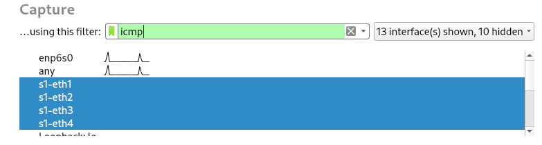
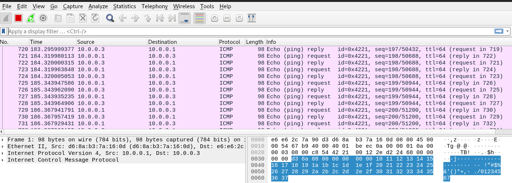
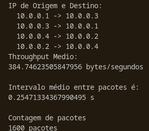
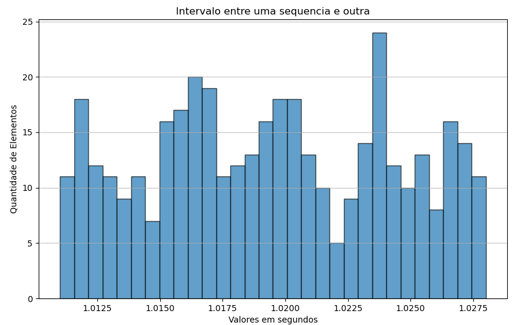

# Analisando o tráfego de rede no Wireshark e no Mininet
## Preparação
Para realizar esse esperimento temos que intalar o `mininet` e o `wireshark`:
```
sudo apt install mininet
sudo apt install wireshark
```
## Experimento
Para realisar o experimento devemos segui o seguinte passo a passo no terminal
```
sudo mn --topo single,4 #Para fazer uma topologia de 4 hosts e 1 switch:

xterm s1 #para abri um terminal auxiliar

#no terminal auxiliar
wireshark & #para abrir o programa
```
no wireshark  
  
no menu superior consiguira gravar e salva os dados para o experimento(salvar como .PCAP).  
  
no terminal principal
```
h1 ping -c 200 h3 #para simular o trafico 
h2 ping -c 200 h4
```
com isso no wireshark poderemos observar ele capturando os dados


agora com o arquivo PCAP salvo na mesma pasta do codigo desse repositório com o nome de `valido.pcap`
ao rodar o codigo teremos uma saida parecida com essa:  
  


## Analise do codigo
```
from scapy.all import *
import matplotlib.pyplot as plt
import numpy as np


def analise_pcap():
    # Carrega o arquivo pcap
    packets = rdpcap("valido.pcap")

    # Inicializa variáveis
    ip_pairs = set()
    timestamps = []
    bytes = 0
    acumulador = 0
    dado = []
    k=0
    
    # Processa cada pacote extraindo o instante enviado
    #  ip origem e destino e o tamanho em bytes 
    for pkt in packets:
        if IP in pkt:
            # Extrai IP de origem e destino
            src = pkt[IP].src
            dst = pkt[IP].dst
            ip_pairs.add((src, dst))
            
            # Coleta timestamp e tamanho do pacote
            timestamps.append(float(pkt.time)) 
            bytes += len(pkt)

    n = len(timestamps)
    while k < (n-4): #para conseguir o tempo entre as sequencias 
        valor = timestamps[k+4] - timestamps[k]
        k += 4
        if valor < 5: #intervalo entre digitar a primeira e a segunda sequencia de pacotes
            dado.append(valor)
            acumulador += valor
    
    tax_med_pac = acumulador/n #para conseguir o tempo medio entre os pacotes
    throughput = bytes/acumulador 

    print("IP de Origem e Destino:")
    for pair in ip_pairs:
        print(f"  {pair[0]} -> {pair[1]}")
    print("Throughput Medio:")
    print(throughput, "bytes/segundos\n")
    print("Intervalo médio entre pacotes é:")
    print(tax_med_pac, "s\n")
    print("Contagem de pacotes")
    print(n , "pacotes\n")

    #definir a quantidade de elementos e o intervalo dos dados para o grafico
    e = len(dado)
    dados = np.random.uniform(min(dado), max(dado), e)

    # Cria histograma
    plt.figure(figsize=(10, 6))
    plt.hist(dados, bins=30, edgecolor='black', alpha=0.7)

    # Adicionar rótulos e título
    plt.xlabel('Valores em segundos')
    plt.ylabel('Quantidade de Elementos')
    plt.title('Intervalo entre uma sequencia e outra')

    # Mostrar o gráfico
    plt.grid(axis='y', alpha=0.75)
    plt.show()


if __name__ == "__main__":
    analise_pcap()
```
